# Programowanie aplikacji w chmurze obliczeniowej - Laboratorium 11
## 1. Utworzenie sieci mostkowej
Docker domyślnie tworzy sieć mostkową, dlatego nie było potrzeby podawania parametru `--driver bridge`.
Sieć `lab11net` została utworzona poleceniem:
```bash
docker network create lab11net
```
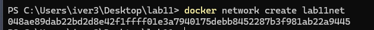

## 2. Uruchomienie kontenerów z nginx i podłączenie wolumenów
Kontenery web1, web2 oraz web3 zostały uruchomione i podłączone do sieci lab11net. Do każdego kontenera dołączono dwa wolumeny:
- katalog z plikami HTML w trybie tylko do odczytu (:ro)
- katalog na logi serwera nginx z możliwością zapisu.

Polecenia do uruchomienia:
```bash
docker run -d --name web1 --network lab11net -p 8081:80 -v C:/Users/iver3/lab11/web1/html:/usr/share/nginx/html:ro -v C:/Users/iver3/lab11/web1/logs:/var/log/nginx nginx:latest
docker run -d --name web2 --network lab11net -p 8082:80 -v C:/Users/iver3/lab11/web2/html:/usr/share/nginx/html:ro -v C:/Users/iver3/lab11/web2/logs:/var/log/nginx nginx:latest
docker run -d --name web3 --network lab11net -p 8083:80 -v C:/Users/iver3/lab11/web3/html:/usr/share/nginx/html:ro -v C:/Users/iver3/lab11/web3/logs:/var/log/nginx nginx:latest
```

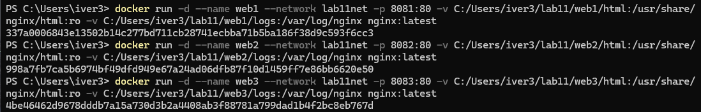

## 3. Potwierdzenie uruchomienia kontenerów
W celu zweryfikowania uruchomionych kontenerów użyto polecenia:
```bash
docker ps
```

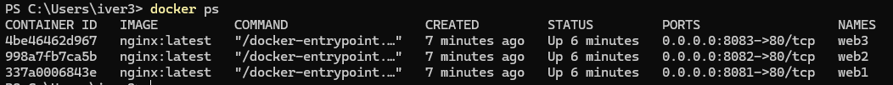

## 4. Potwierdzenie działania kontenerów w sieci lab11net
Za pomocą polecenia:
```bash
docker network inspect lab11net
```
sprawdzono, że wszystkie trzy kontenery są podłączone do utworzonej sieci mostkowej.

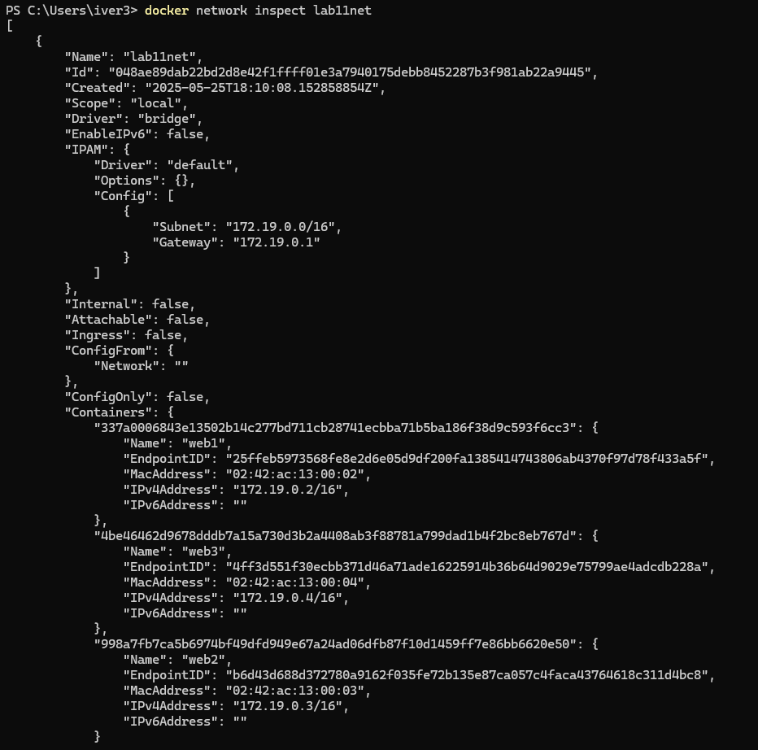

## 5. Potwierdzenie poprawnego nadania uprawnień dla wolumenów
Polecenia:
```bash
docker container inspect web1
docker container inspect web2
docker container inspect web3 
```
potwierdziły poprawne podpięcie wolumenów z plikami HTML oraz katalogów z logami oraz właściwe uprawnienia.

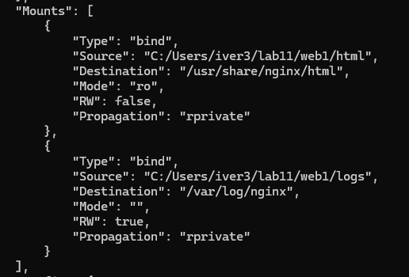

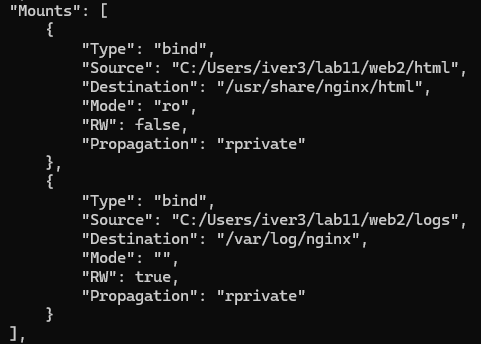

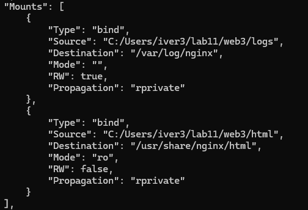

## 6. Potwierdzenie poprawnego działania aplikacji
Dostępność stron w przeglądarce lub poprzez curl potwierdzono poleceniami:
```bash
curl http://localhost:8081
curl http://localhost:8082
curl http://localhost:8083
```

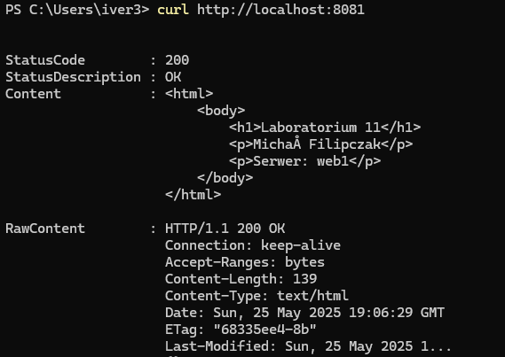

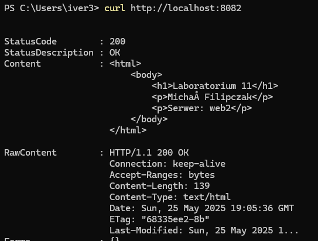

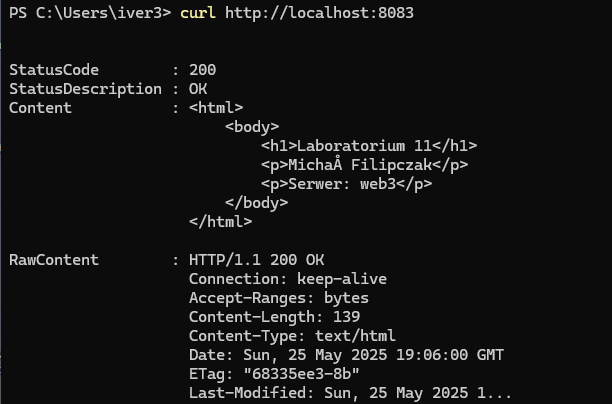

## 7. Sprawdzenie logów z maszyny macierzystej
Poprawność zapisu logów nginx w katalogach lokalnych zweryfikowano poleceniami:
```bash
ls ~/lab11/web1/logs
ls ~/lab11/web2/logs
ls ~/lab11/web3/logs

cat ~/lab11/web1/logs/access.log
```
W katalogach obecne były pliki logów, a ich zawartość odpowiadała zapytaniom do serwera.

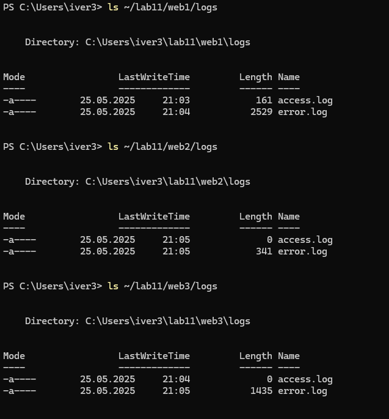

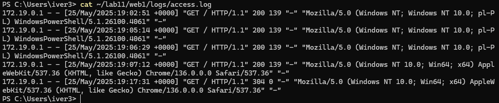
